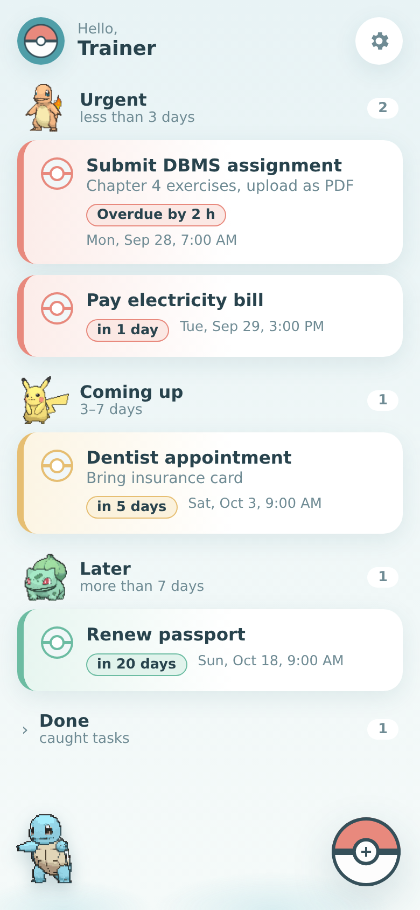
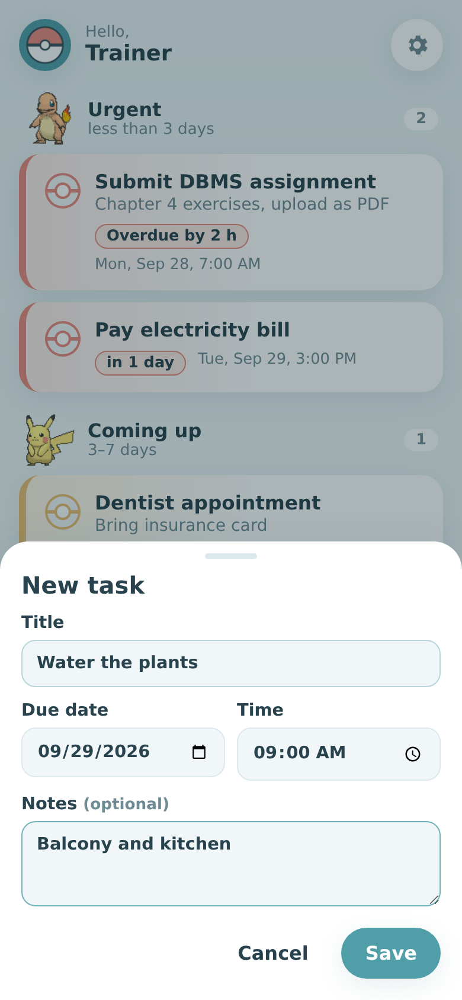
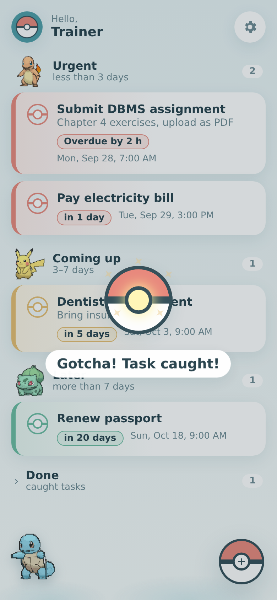

  

<h1 align="center">Task Reminder</h1>

A calm, Pokémon-themed to-do list that reminds you before things are due.

  
  &nbsp;
  
  &nbsp;
  

- 🔴 **Red**: due in less than 3 days, always on top · 🟡 **Yellow**: 3–7 days · 🟢 **Green**: more than 7 days
- 🔔 Notifications when a task turns red, a day before it's due, when it's due, plus a morning summary
- 🔐 Sign in with Google, and your tasks are saved to your account

## Get it

- **Android app:** [download the APK](https://github.com/Ansh-mick27/task-reminder-app/releases/latest/download/task-reminder.apk). Google Chrome must be installed.
- **Web:** <https://task-reminder-f7a06.web.app>
- **How to use it:** [user guide (PDF)](docs/Task-Reminder-Manual.pdf)

Setup and maintenance notes are in [docs/SETUP.md](docs/SETUP.md). Pokémon © Nintendo / Game Freak / The Pokémon Company; this is a personal project, not for app stores.
